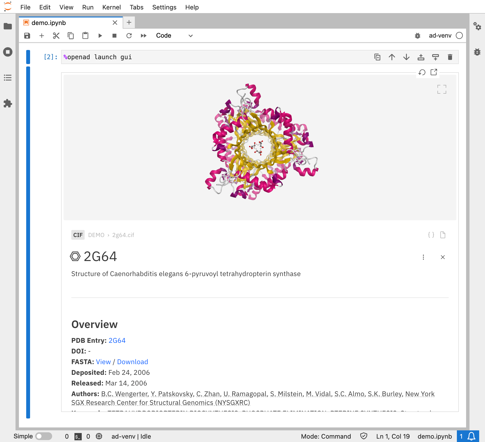
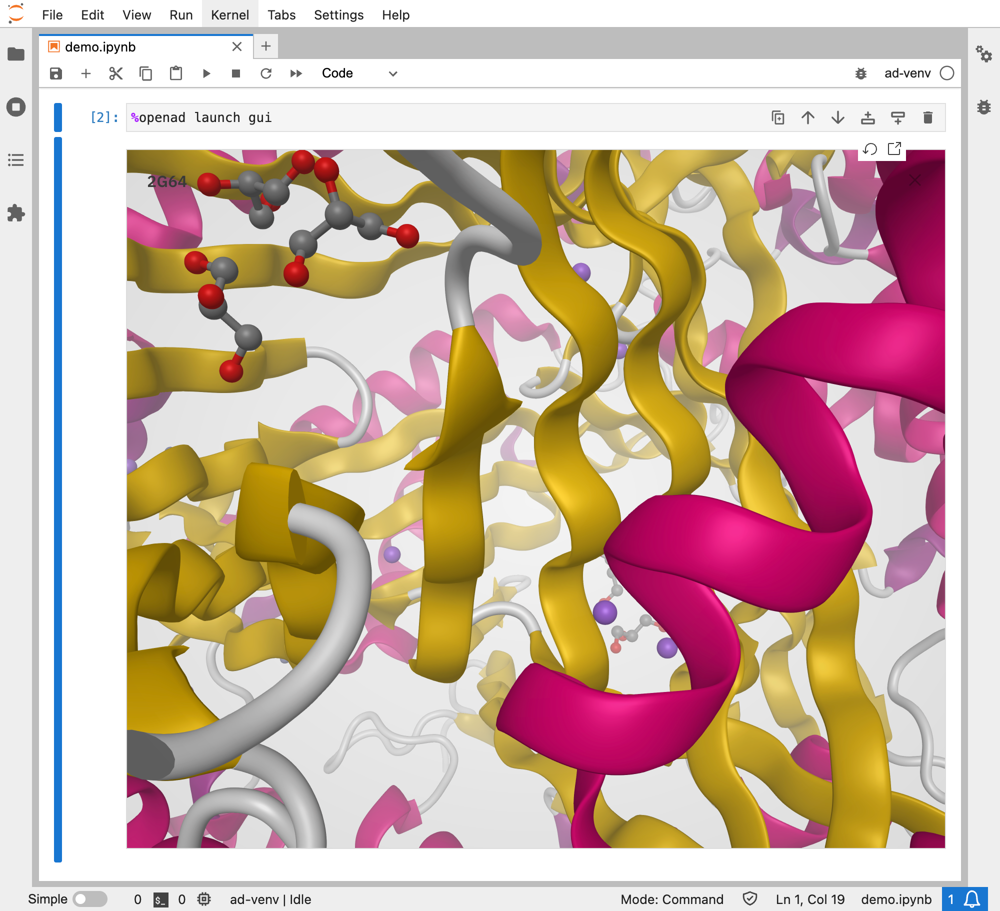

# How to Visualize Proteins in Jupyter Notebook

Learn how to use OpenAD to visualize proteins and other macromolecules from:

- PDB or CIF files
- FASTA strings

<!-- more -->

<!-- INSERT:INSTALL_OPENAD_JUP.md -->

<!-- INSERT:JUP_VS_CLI.md -->

## Visualizing PDF and CIF Files

Let's start with downloading some sample proteins:

- [2g64.cif](/_assets/sample_molecules/2g64.cif)
- [9bq4.pdb](/_assets/sample_molecules/9bq4.pdb)

In order to visualize a PDF or CIF file, all we need to do is to import them into your workspace. Update the source paths if needed.

```shell
%openad import from '~/Downloads/2g64.cif' to '2g64.cif'
%openad import from '~/Downloads/9bq4.pdb' to '9bq4.pdb'
```

Then simply open them:

```shell
%openad open '2g64.cif'
%openad open '9bq4.pdb'
```

Alternatively, you can open your workspace and double click on your protein files from there.

```shell
%openad launch gui
```

Inside the macromolecule viewer, you'll find a 3D visualization as well as the most important information from the PDB.

{ .img-border }

{ .img-border }

{ .img-border }

If you need to see more details or get access to more advanced renderings, there's a link to  the molecule's PDB entry page.

{ .img-border }