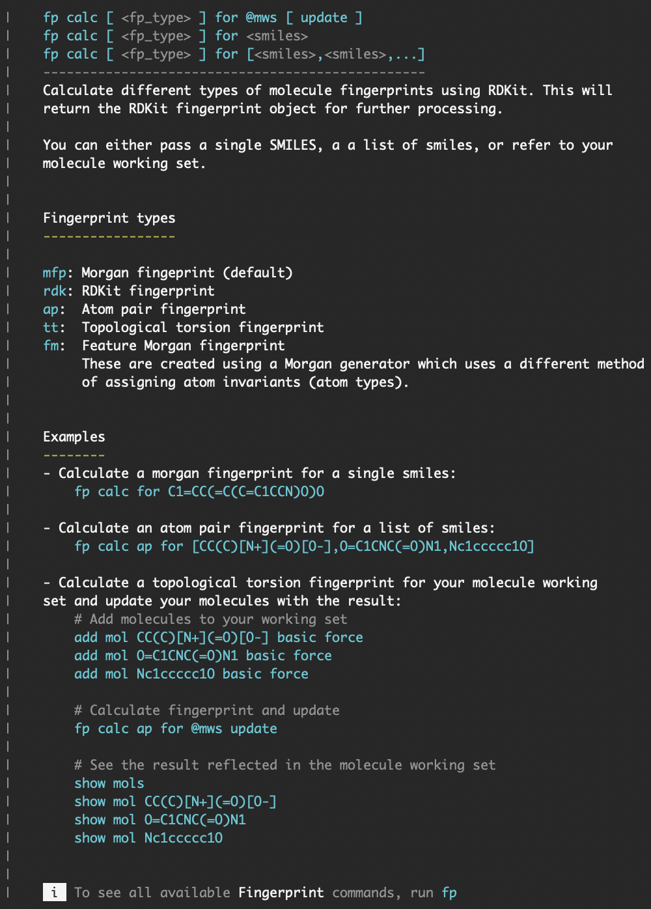
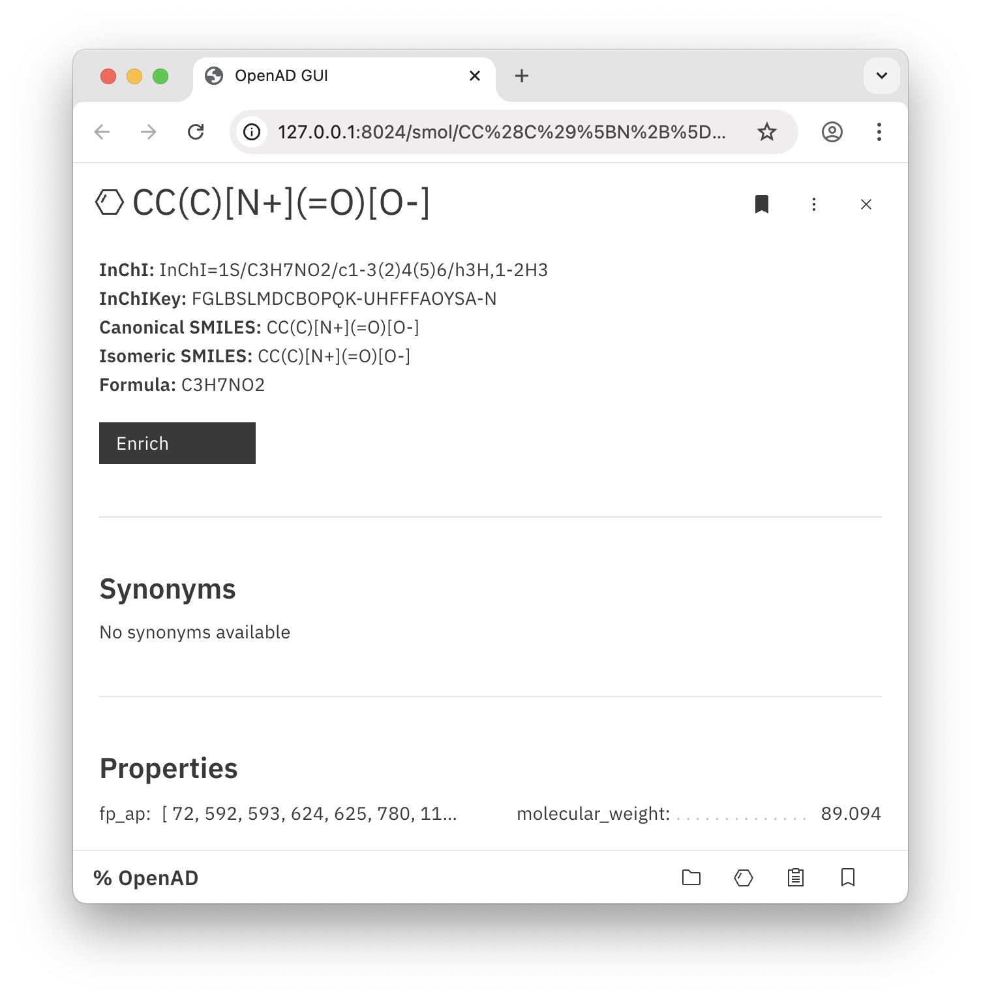

# How to Build a Plugin for OpenAD

In this tutorial, we'll build an OpenAD plugin from start to finish, allowing you to calculate different types of fingerprints of a molecule using RDKit.

<!-- more -->

We'll use Greg Landrum's [2022 blog post on generating fingerprints with RDKIt](https://greglandrum.github.io/rdkit-blog/posts/2023-01-18-fingerprint-generator-tutorial.html) and implement this functionality in our plugin.

This is an example plugin implementation. For a more general (and shorter) guide on building plugins for OpenAD, check out our [Plugin Developer Guide](/documentation/plugin-development/index.md).

!!! note
    Download the finished plugin from GitHub: [openad-plugin-tutorial](https://github.com/acceleratedscience/openad-plugin-tutorial)

## 1. 

<div class="padded-list" markdown>

1. Clone the [demo plugin repository](https://github.com/acceleratedscience/openad-plugin-demo) to use as a scaffold.
```shell
git clone --no-remote git@github.com:acceleratedscience/openad-plugin-demo.git
```
    
1. Rename the plugin directories:  
    `/openad-plugin-demo/openad_plugin_demo` to `/openad-plugin-fingerprint/openad_plugin_fingerprint`  

    ```shell
    mv openad-plugin-demo openad-plugin-fingerprint
    ```
    ```shell
    cd openad-plugin-fingerprint
    ```
    ```shell
    mv openad_plugin_demo openad_plugin_fingerprint
    ```

2. Delete all commands inside the `/commands` directory, except `/hello_world`.

3. Update `pyproject.toml` and set the `name` field to `openad_plugin_fingerprint`.

4. Update `plugin_metadata.yaml` - this is used for the help display.
```shell
name: Fingerprint
namespace: fp
description: Calculate a molecule's fingerprints using RDKit.
author: null
version: 0.0.1
github: null
website: null
```

1. Delete `plugin_description.txt`, we've added the description in the metadata file instead.

2. Open `plugin_params.py` and delete everything below `# --- Edit below this line --- #`

3. Rename the `/hello_world` directory to `/calculate_fp`.

4. Open `/calculate_fp/command.py` and look for `# <-- UPDATE` and update the import statements so they point to `openad_plugin_fingerprint`

5. Install the plugin  
    If you haven't already, make sure your file cursor is pointed to the parent `/openad-plugin-fingerprint` directory, and if you have installed OpenAD in a virtual environment, of course make sure you have the virtual environment activated. We'll install the plugin with the `--editable` flag, so we can update the code and see the results in real time.

    ```shell
    cd openad-plugin-fingerprint
    ```
    ```shell
    pip install -e .
    ```

6. Launch openad and run `fp ?` - you should see the plugin's splash screen with the `fp hello world` command listed

</div>

## 2. Command Documentation

We'll start with the command documentation. The `help_dict_create_v2()` function inside `command.py` defines how the command structure will be displayed in the help.

### Defining Functionality

Let's start with defining what our plugin will do:

- Input: one or more SMILES identifiers, or the molecules in your molecule working set (MWS)
- Calculate one of 5 types of fingerprints:
    - `mfp` - Morgan fingerprint (default)
    - `rdk` - RDKit fingerprint
    - `ap`  - Atom pair fingerprint
    - `tt`  - Topological torsion fingerprint
    - `fm`  - Feature Morgan fingerprint
- Optionally store the results in the MWS, if the MWS was the input source

### Defining Command Structure

We would like to enable the following command variations:

- `fp calc for C1=CC(=C(C=C1CCN)O)O`  
Calculate default fingerprint for a single molecule.
- `fp calc for [CC(C)[N+](=O)[O-],O=C1CNC(=O)N1,Nc1ccccc1O]`  
Calculate default fingerprint for a list of molecules.
- `fp calc for @mws`  
Calculate default fingerprint for all molecules in my molecule working set.
- `fp calc for @mws update`  
Calculate default fingerprint for all molecules in my MWS, then update MWS with results.
- `fp calc tt for C1=CC(=C(C=C1CCN)O)O`  
Calculate topological torsion fingerprint for a single molecule.
- etc.
  
### Notating Command Structure

We can summarize this structure in three variations:

```shell
fp calc [ <fp_type> ] for <smiles>
```
```shell
fp calc [ <fp_type> ] for [<smiles>,<smiles>,...]
```
```shell
fp calc [ <fp_type> ] for @mws [ update ]
```

Let's provide these variations to the function.

```python
# Command help
grammar_help.append(
    help_dict_create_v2(
        plugin_name=PLUGIN_NAME,
        plugin_namespace=PLUGIN_NAMESPACE,
        category=self.category,
        command=[
            f"{PLUGIN_NAMESPACE} calc [ <fp_type> ] for @mws [ update ]",
            f"{PLUGIN_NAMESPACE} calc [ <fp_type> ] for <smiles>",
            f"{PLUGIN_NAMESPACE} calc [ <fp_type> ] for [<smiles>,<smiles>,...]",
        ],
        description_file=description_txt(__file__),
    )
)
```

### Writing Plugin Description

Let's describe to the users what our plugin does, what the options are, and how it's supposed to be used, while using the [OpenAD styling syntax](/documentation/plugin-development/knowledge-base.md#printing-text) to create a clean and organized help screen.

```text
Calculate different types of molecule fingerprints using RDKit. This will return the RDKit fingerprint object for further processing.

You can either pass a single SMILES, a a list of smiles, or refer to your molecule working set.


<h1>Fingerprint types</h1>

<cmd>mfp</cmd>: Morgan fingerprint (default)
<cmd>rdk</cmd>: RDKit fingerprint
<cmd>ap</cmd>:  Atom pair fingerprint
<cmd>tt</cmd>:  Topological torsion fingerprint
<cmd>fm</cmd>:  Feature Morgan fingerprint
     These are created using a Morgan generator which uses a different method of assigning atom invariants (atom types).


<h1>Examples</h1>
- Calculate a morgan fingerprint for a single smiles:
    <cmd>fp calc for C1=CC(=C(C=C1CCN)O)O</cmd>

- Calculate an atom pair fingerprint for a list of smiles:
    <cmd>fp calc ap for [CC(C)[N+](=O)[O-],O=C1CNC(=O)N1,Nc1ccccc1O]</cmd>

- Calculate a topological torsion fingerprint for your molecule working set and update your molecules with the result:
    <soft># Add molecules to your working set</soft>
    <cmd>add mol CC(C)[N+](=O)[O-] basic force</cmd>
    <cmd>add mol O=C1CNC(=O)N1 basic force</cmd>
    <cmd>add mol Nc1ccccc1O basic force</cmd>

    <soft># Calculate fingerprint and update</soft>
    <cmd>fp calc ap for @mws update</cmd>

    <soft># See the result reflected in the molecule working set</soft>
    <cmd>show mols</cmd>
    <cmd>show mol CC(C)[N+](=O)[O-]</cmd>
    <cmd>show mol O=C1CNC(=O)N1</cmd>
    <cmd>show mol Nc1ccccc1O</cmd>
```


To see the result, you can now run:

```shell
fp calc ?
```

<p class="cli-ss-wrap" markdown>
    { width="500" style="max-width: 100%" }
</p>

## 3. Command Grammar

Earlier you duplicated `commands/hello_world` and renamed it to `commands/calculate_fp`. Inside you'll find the `command.py` file, which is where all the action happens.

### Notes

- The command definition is created using PyParsing. If you're new to PyParsing, check out our [PyParsing 101](/documentation/plugin-development/pyparsing-101.md) crash course to get up to speed in no time.
- Each word in a command is represented by a "grammar definition". We'll store our grammar definitions in `plugin_grammar_def.py` so they can be reused across commands.
- We have a number of readymade grammar definitions that can be imported as building blocks. You can check these out here: [openad_tools.grammar_def.py](https://github.com/acceleratedscience/openad-tools/blob/main/openad_tools/grammar_def.py)

### Compiling the Command

<div class="padded-list" markdown>

1. We want to support an individual molecule identifier as well as a list of identifiers as input. For this we can simply import the `molecule_identifier_s` definition, which handles both.

    ```python
    from openad_tools.grammar_def import molecule_identifier_s
    ```

2. Then we'll create the other parts of our command and store them in `plugin_grammar_def.py`.  
    Two things to note: we'll support both `calc` as `calculate`, and the identifier for the word `for` is called `f_or` so it doesn't interfer with the Python's "for" used for looping.
    
    ```python
    # File: plugin_grammar_def.py
    calculate = py.CaselessKeyword("calc") | py.CaselessKeyword("calculate")
    f_or = py.CaselessKeyword("for")
    fp_type = py.MatchFirst(
        [
            py.CaselessKeyword("mfp"),
            py.CaselessKeyword("rdk"),
            py.CaselessKeyword("ap"),
            py.CaselessKeyword("tt"),
            py.CaselessKeyword("fm"),
        ]
    )
    clause_update = py.Optional(py.CaselessKeyword("update"))("update")
    ```
    ```python
    # File: command.py
    from openad_plugin_fingerprint.plugin_grammar_def import calculate, fp_type, f_or, clause_update
    ```

3. Let's now put them together to create our command.
   
    ```python
    # Command definition
    statements.append(
        py.Forward(
            py.CaselessKeyword(PLUGIN_NAMESPACE)
            + calculate
            + py.Optional(fp_type)
            + f_or
            + (molecule_working_set | molecule_identifier_s)
            + clause_update
        )(self.parser_id)
    )
    ```
</div>

## 4. Testing the Parser

Now the command is in place, let's test if it gets parsed as intended. Don't forget to reboot OpenAD for the changed to take effect.

```python
def exec_command(self, cmd_pointer, parser):
    """Execute the command"""

    cmd = parser.as_dict()
    print(cmd)
```

Input / output #1:
```shell
fp calc for C1=CC(=C(C=C1CCN)O)O
```
```shell
{'identifiers': ['C1=CC(=C(C=C1CCN)O)O'], 'plugin_fingerprint_calculate_fp': ['fp', 'calc', 'for', ['C1=CC(=C(C=C1CCN)O)O']]}
```

Input / output #2:
```shell
fp calc ap for [CC(C)[N+](=O)[O-],O=C1CNC(=O)N1,Nc1ccccc1O]
```
```shell
{'fp_type': 'ap', 'identifiers': ['CC(C)[N+](=O)[O-]', 'O=C1CNC(=O)N1', 'Nc1ccccc1O'], 'plugin_fingerprint_calculate_fp': ['fp', 'calc', 'ap', 'for', 'CC(C)[N+](=O)[O-]', 'O=C1CNC(=O)N1', 'Nc1ccccc1O']}
```

Input / output #3:  
```shell
fp calc ap for @mws update
```
```shell
{'fp_type': 'ap', 'mws': '@mws', 'update': 'update', 'plugin_fingerprint_calculate_fp': ['fp', 'calc', 'ap', 'for', '@mws', 'update']}
```

This is looking good. Let's move on to the command's logic.

## 5. Command Logic

To keep things organized, we'll put the functionality in a separate file which we'll call `calculate_fp.py` and store it in the command folder. This way we can separate the parsing logic from the function logic and keep things organized.

Parsing logic:
```python
# File: command.py
from openad_plugin_fingerprint.commands.calculate_fp.calculate_fp import calculate_fp, fp_to_list

def exec_command(self, cmd_pointer, parser):
    """Execute the command"""

    cmd = parser.as_dict()
    # print(cmd)

    # Parse identifiers
    from_mws = "mws" in cmd
    # A. from molecule working set
    if from_mws:
        smiles_list = [get_best_available_smiles(mol) for mol in cmd_pointer.molecule_list]
        if len(smiles_list) == 0:
            return output_error("No molecules in the working set")
    # B. from command
    else:
        smiles_list = cmd.get("identifiers")

    # Parse command arguments
    is_single = len(smiles_list) == 1
    fp_type = cmd.get("fp_type", "mfp")  # Default fingerprint type is Morgan
    udpate_mws = "update" in cmd

    # Calculate fingerprint for each SMILES string
    results = []
    for i, smiles in enumerate(smiles_list):
        fp = calculate_fp(smiles, fp_type)
        results.append(fp)

        # Update molecule working set if requested
        if from_mws and udpate_mws:
            mol = cmd_pointer.molecule_list[i]
            mol.get("properties", {})[f"fp_{fp_type}"] = fp_to_list(fp)

            # Log
            mol_name = mol.get("name") or get_best_available_smiles(mol)
            if fp:
                output_success(f"{i:>3}: fp_{fp_type} saved for for molecule: {mol_name}")
            else:
                output_error(f"{i:>3}: No fp_{fp_type} available for molecule: {mol_name}")

    # Return a single result or a list of results
    if is_single:
        return results[0]
    else:
        return results
```

Function logic:
```python
# RDKit
from rdkit import Chem
from rdkit import DataStructs
from rdkit.Chem import rdFingerprintGenerator

# Data typing
from typing import Literal

# OpenAD
from openad.app.global_var_lib import GLOBAL_SETTINGS
from openad_tools.output import output_error, output_warning, output_text, output_success, output_table

#
#

# Define generators
generators = {
    "mfp": rdFingerprintGenerator.GetMorganGenerator(radius=2, fpSize=2048),
    "rdk": rdFingerprintGenerator.GetRDKitFPGenerator(fpSize=2048),
    "ap": rdFingerprintGenerator.GetAtomPairGenerator(fpSize=2048),
    "tt": rdFingerprintGenerator.GetTopologicalTorsionGenerator(fpSize=2048),
    # Feature Morgan fingerprints are created using a Morgan generator which
    # uses a different method of assigning atom invariants (atom types)
    "fm": rdFingerprintGenerator.GetMorganGenerator(
        radius=2, fpSize=2, atomInvariantsGenerator=rdFingerprintGenerator.GetMorganFeatureAtomInvGen()
    ),
}

#
#


def calculate_fp(smiles: str, fp_type: Literal["mfp", "rdk", "ap", "tt", "fm"]):
    """Calculate the fingerprint of a molecule"""

    # Create RDKit molecule object
    rdkit_mol = Chem.MolFromSmiles(smiles)
    if rdkit_mol is None:
        output_error(f"Invalid SMILES string: <yellow>{smiles}</yellow>", return_val=False)
        return None

    # Select appropriate generator
    if fp_type not in generators:
        return output_error(
            f"Fingerprint type '{fp_type}' not recognized. Supported types are: {', '.join(generators.keys())}"
        )
    gen = generators[fp_type]

    # Generate fingerprint
    result = gen.GetFingerprint(rdkit_mol)

    # Return the fingerprint object
    return result


def fp_to_list(fp):
    """Convert an RDKit fingerprint object into a list"""
    bit_indices = list(fp.GetOnBits())
    return bit_indices


def list_to_fp(bit_indices):
    """Convert a fingerprint list to an RDKit fingerprint object"""
    fp = DataStructs.ExplicitBitVect(2048)
    for i in bit_indices:
        fp[i] = 1
    return fp
```

## 6. Testing the Plugin

### Calculating Fingerprint in a Jupyter Notebook

We'll want to test the plugin from a Jupyter Notebook, since the returned fingerprint object is rather useless in the terminal.

```python
# Calculate fingerprint
fingerprint = %openadd fp calc for C1=CC(=C(C=C1CCN)O)O

##

# The fingerprint is an ExplicitBitVect object
print(f"Fingerprint class name:\n   {type(fingerprint).__name__}\n")

# Number of bits in the fingerprint
num_bits_set = fingerprint.GetNumOnBits()
print(f"Number of bits set:\n   {num_bits_set}\n")

# The indices of the bits that are set
on_bits = list(fingerprint.GetOnBits())
print(f"Indices of bits set:\n   {on_bits}\n")

# Convert the fingerprint to a list of integers (0 or 1)
bit_list = list(fingerprint)
print(f"Bit list:\n   {bit_list[:10]} ... (showing first 10)\n")

# Convert the fingerprint to a numpy array (useful for machine learning)
import numpy as np
fingerprint_array = np.array(fingerprint)
print(f"Numpy array:\n   {fingerprint_array[:10]} ... (showing first 10)\n")
```

Output:
```shell
Fingerprint class name:
   ExplicitBitVect

Number of bits set:
   21

Indices of bits set:
   [80, 104, 193, 310, 315, 589, 807, 875, 937, 981, 1168, 1171, 1243, 1380, 1475, 1602, 1607, 1750, 1754, 1840, 1873]

Bit list:
   [0, 0, 0, 0, 0, 0, 0, 0, 0, 0] ... (showing first 10)

Numpy array:
   [0 0 0 0 0 0 0 0 0 0] ... (showing first 10)
```

### Calculating Fingerprints for your Molecule Working Set

More practical would be to update all molecules in the MWS with a certain fingerprint.  
To demo this, we'll first need to add a few molecules to the MWS:
```shell
add mol CC(C)[N+](=O)[O-] basic force
add mol O=C1CNC(=O)N1 basic force
add mol Nc1ccccc1O basic force
```

Then we can calculate the topological torsion fingerprint and update our molecules with the result:
```python
fp calc ap for @mws update
```

Let's check one of the results:
```shell
show mol CC(C)[N+](=O)[O-]
```

{ width=752 .browser-ss }

<br>

## Congratulations

You've created your first plugin.

!!! note
    Download the finished plugin from GitHub: [openad-plugin-tutorial](https://github.com/acceleratedscience/openad-plugin-tutorial)