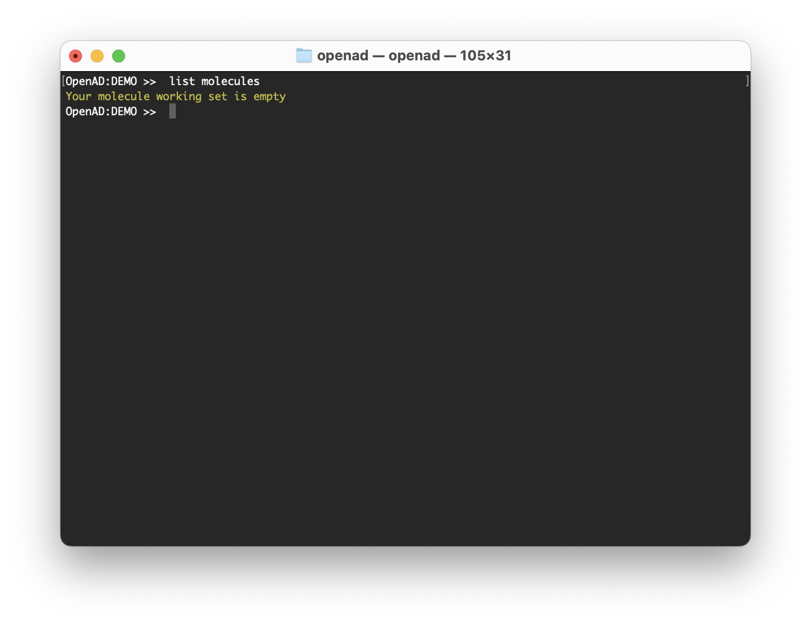
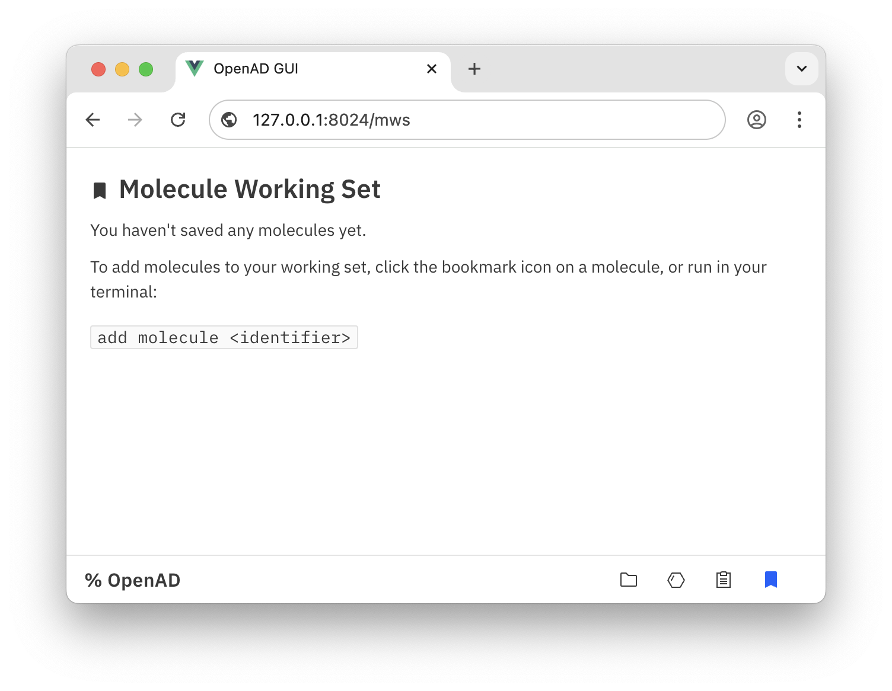

# How to Use the Molecule Working Set

Your molecule working set (MWS) is an in-memory list of small molecules that is the subject of your calculations and manipulations.

<!-- more -->

<!-- INSERT:INSTALL_OPENAD.md -->

<!-- INSERT:CLI_VS_JUP.md -->

## About the MWS

Your "Molecule Working Set" or MWS functions like a bucket where you can add molecules from various sources, to then review, triage or manipulate them together and export them to a new file.

!!! Warning
    When you end your session or restart your Jupyter kernel, the MWS gets erased.

At any given time, you can list your molecules, or display them in the GUI (graphical user interface). In the beginning of your session, your MWS will be empty.

```shell
list molecules
```

{ width=752 .browser-ss }

```shell
show molecules
```

{ width=752 .browser-ss }


## Loading Individual Molecules

To add the molecule `CCCCCC=CC=CC(=O)OCC` (Ethyl decadienoate or pear flavor) to your working set, simply run the command below. This will ask for confirmation, then create the molecule and fetch any available data from PubChem.

```shell
add mol CCCCCC=CC=CC(=O)OCC
```

Aside from any valid SMILES or InChI, if a molecule is available on PubChem you can add it by name, InChIKey or PubChem CID.

If you're using SMILES or InChI as identifier and you don't need the enrichment from PubChem, you can add the `basic` clause. And If you prefer to skip the confirmation step, you can add the `force` clause.

Let's add a few more flavors to our molecular fruit salad.

```shell
add mol InChI=1S/C7H14O2/c1-6(2)4-5-9-7(3)8/h6H,4-5H2,1-3H3 force
```
```shell
add mol Isobutylbenzene force
```
```shell
add mol 'ethyl methylphenylglycidate' force
```
```shell
add mol HUMNYLRZRPPJDN-UHFFFAOYSA-N force
```
```shell
add mol 21648 force
```

Now we have pear, banana, cherry, strawberry, cherry and raspberry in our MWS. Let's list our salad.

```shell
list mols
```

{ width=752 .browser-ss }

Or we can inspect them in the GUI.

```shell
show molecules
```

{ width=752 .browser-ss }

## Loading Molecules in Batch

Of course most of the time you'll want to load many molecules at once, sometimes from different file formats. So that's what we'll do.

Download the sample files below and copy them into your workspace. Update the file path if needed.

-   [sample_molecules1.sdf](/_assets/sample_molecules/sample_molecules1.sdf)
-   [sample_molecules2.csv](/_assets/sample_molecules/sample_molecules2.csv)
-   [sample_molecules3.smi](/_assets/sample_molecules/sample_molecules3.smi)

```shell
import from '~/Downloads/sample_molecules1.sdf' to 'sample_molecules1.sdf'
```
```shell
import from '~/Downloads/sample_molecules2.csv' to 'sample_molecules2.csv'
```
```shell
import from '~/Downloads/sample_molecules3.smi' to 'sample_molecules3.smi'
```

Once the files are in your workspace, you can easily load them into your MWS.

Don't forget the `append` clause.

```shell
load mols from file 'sample_molecules1.sdf'
```
```shell
load mols from file 'sample_molecules2.csv' append
```
```shell
load mols from file 'sample_molecules3.smi' append
```

Now when you inspect your MWS, you’ll see you have 34 molecules loaded.

```shell
show molecules
```

{ width=1000 .img-border }

<!-- INSERT:CONTINUE_LEARNING_SMOLS.md -->