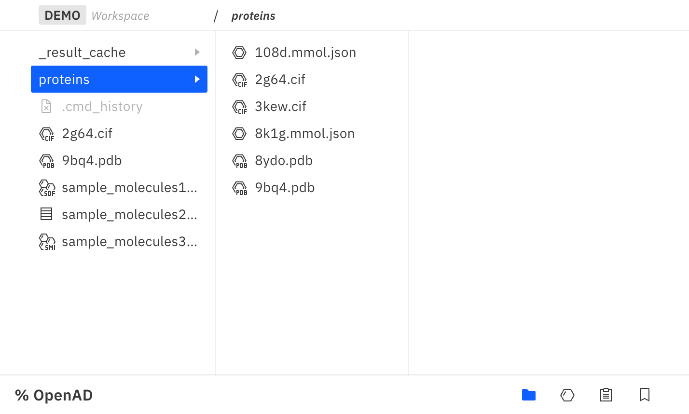
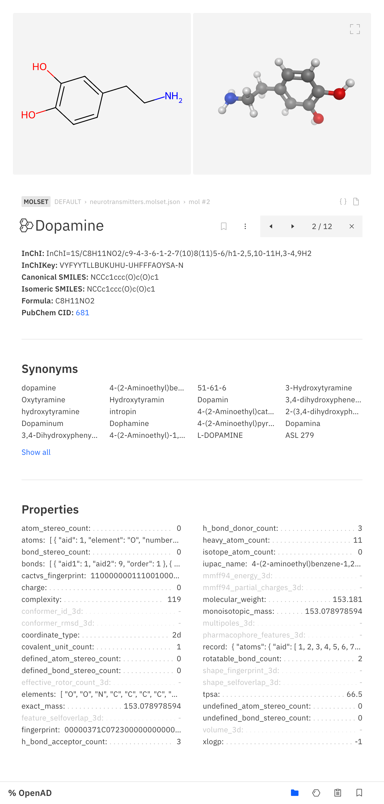
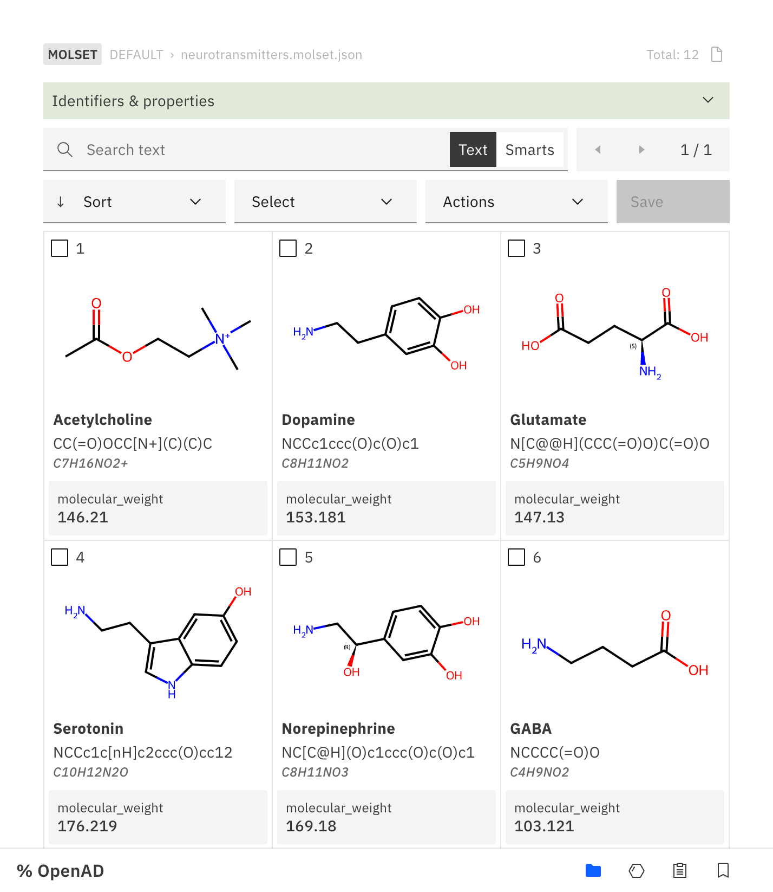
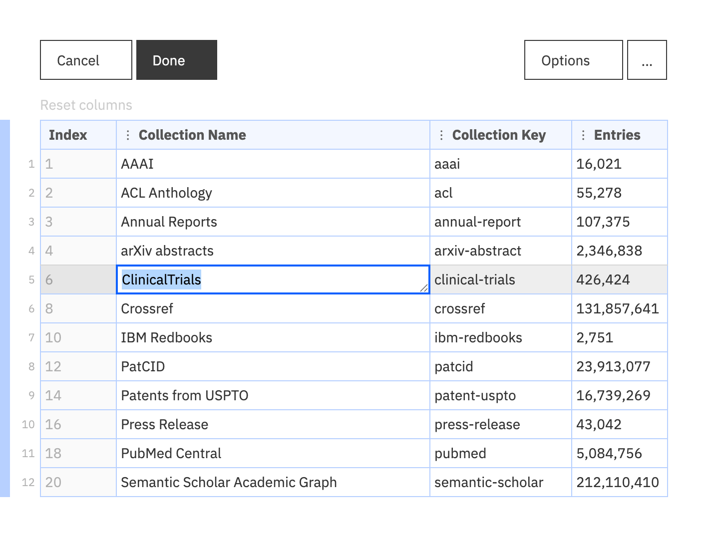

# Graphical User Interface (GUI)

The OpenAD GUI is an interface that lets you instantly visualize your results and open molecule files like SDF, PDB, CIF etc.

The GUI consists of:

-   ### [File Browser](#file-browser_1)

    To display the files in your workspace.

    ```shell
    launch gui
    ```

    [{ width=200 height=100 style='border: solid 1px rgba(0,0,0,.1)' }](#file-browser_1)

-   ### [Molecule Viewer](#molecule-viewer_1)

    To visualize any recognized identifier (SMILES, InChI, InChIKey, name, FASTA) as well as molecule files. It supports small molecules as well as macromolecules like proteins or crystals.

    ```shell
    show mol dopamine
    show mol C1=CC(=C(C=C1CCN)O)O
    show mol InChI=1S/C8H11NO2/c9-4-3-6-1-2-7(10)8(11)5-6/h1-2,5,10-11H,3-4,9H2
    show mol VYFYYTLLBUKUHU-UHFFFAOYSA-N
    ```

    [{ width=200 style='border: solid 1px rgba(0,0,0,.1); height: 175px; object-fit: cover; object-position: top' }](#molecule-viewer_1)

-   ### [Molecule Set Viewer](#molecule-set-viewer_1)

    To visualize, sort and filter collections of small molecules (SDF, CSV, SMI).

    ```shell
    show molset 'candidates.sdf'
    show molset 'candidates.molset.json'
    show molset 'candidates.csv'
    ```

    [{ width=200 style='border: solid 1px rgba(0,0,0,.1)' }](#molecule-set-viewer_1)

-   ### [Data Viewer](#data-viewer_1)

    To display and edit the contents of any CSV file.

    ```shell
    display data 'sample_data.csv'
    ```

    ```shell
    result open
    ```

    [{ width=200 style='border: solid 1px rgba(0,0,0,.1)' }](#data-viewer_1)

## Preview

### File Browser

{ style='box-shadow: 0 0 30px rgba(0,0,0,.03); border: solid 1px rgba(0,0,0,.1)' }

### Molecule Viewer

{ style='box-shadow: 0 0 30px rgba(0,0,0,.03); border: solid 1px rgba(0,0,0,.1)' }

### Molecule Set Viewer

{ style='box-shadow: 0 0 30px rgba(0,0,0,.03); border: solid 1px rgba(0,0,0,.1)' }

### Data Viewer

{ style='box-shadow: 0 0 30px rgba(0,0,0,.03); border: solid 1px rgba(0,0,0,.1)' }
