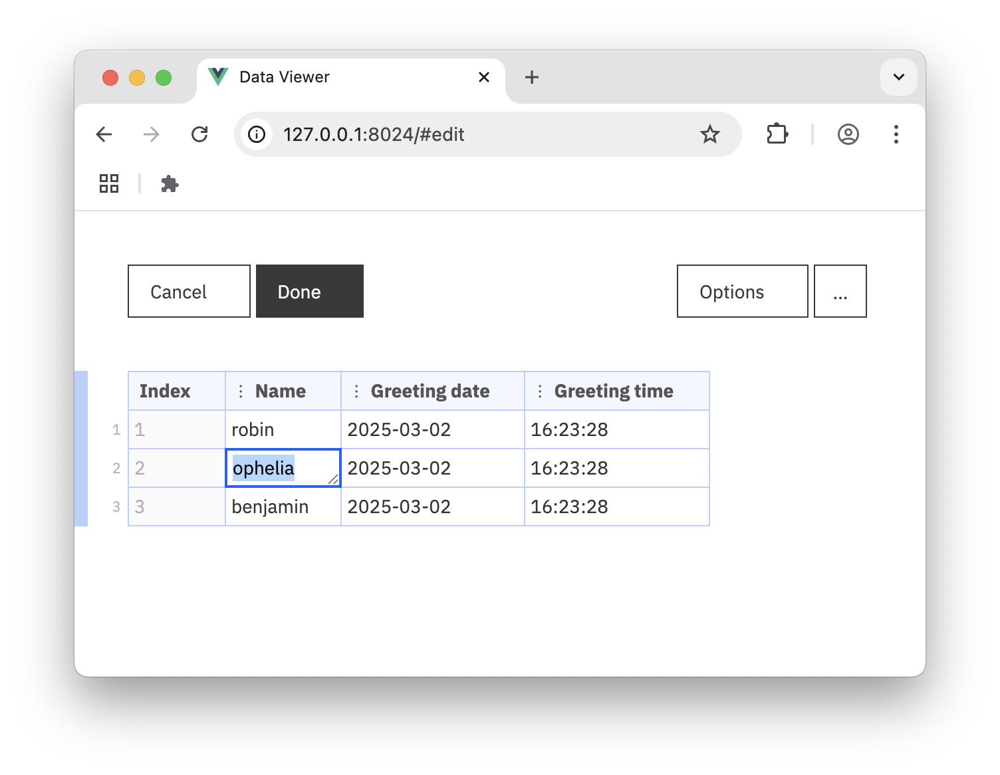
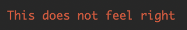
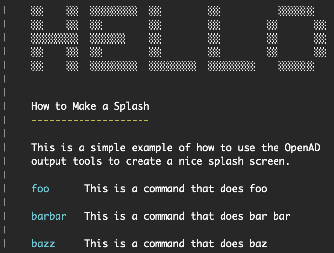

# Knowledge Base

Below a few key concepts you will want to familiarize yourself with if you're going to develop an OpenAD plugin.

## Working with Data

### Returning Data

If your command returns a dataframe, it is recommended to wrap it with `output_table()`, this enables the user to edit, display or save your data by making it available to follow-up commands.

Example:

```shell
demo hello Robin, Ophelia, Benjamin
```
```shell
List of greeted subjects
------------------------

Name      Greeting date    Greeting time
--------  ---------------  ---------------
robin     Mar 2, 2025      16:23:28
ophelia   Mar 2, 2025      16:23:28
benjamin  Mar 2, 2025      16:23:28

Next up, you can run: result open/edit/copy/display/as dataframe/save [as '<filename.csv>']
```
```shell
result edit
```

{ .browser-ss width=752 }

### Styled vs. Raw Data

Sometimes you may want to style or otherwise manipulate your dataframe for display one way or another. In this case, always make sure to return the raw, unstyled data in API mode.

```python
from openad.app.global_var_lib import GLOBAL_SETTINGS

# ...
df = pd.DataFrame(result)
styled_df = df.style.set_properties(**{"text-align": "left"})

if GLOBAL_SETTINGS["display"] == "api":
    return df
else:
    return output_table(styled_df)
```

Note that the `%openadd` magic command (which is used to store raw data from a command into a variable) also uses the API display mode:

```python
foo = %openad demo hello world
```

Learn more about [display modes](display-modes) below.

## Printing Text

Don't use `print()` in your plugins. Instead use `output_text()`, `output_success()` and `output_error()`.

OpenAD has its own simple XML styling syntax to massage your output for a more pleasant display. This not only takes care of the messy [ANSI escape codes](https://en.wikipedia.org/wiki/ANSI_escape_code) for you, it also parses the output automatically for terminal, Jupyter and API output.

We plan to document this in more detail at some point in the future. Until then, there's a practical demo with the [`demo output styles`](https://github.com/acceleratedscience/openad-plugin-demo/tree/main/openad_plugin_demo/commands/output_styles) command that covers most of it. You can also check out the [style parser](https://github.com/acceleratedscience/openad-tools/blob/main/openad_tools/style_parser.py) to see what more it can do.

!!! Warning
    All output functions (including `output_table()`) will return the styled content in Jupyter instead of printing it. So unless you're using it to return the result of your function, you will need to add `return_val=False` to your output function. For example:

    ```python
    # Print anywhere
    output_text('hello, world', return_val=False)

    # Return result
    output_text(result)
    ```

Simple example:

```shell
output_error('This does not feel right', return_val=False)
```

<p class="cli-ss-wrap" markdown>
{ width="160" style="max-width: 100%" }
</p>

More elaborate example, how we built our splash screen:

```shell
fat_header = ascii_type("hello")
h1 = "\n<h1>How to Make a Splash</h1>\n"
text = "This is a simple example of how to use the OpenAD output tools to create a nice splash screen."
commands = {
    "foo": "This is a command that does foo",
    "barbar": "This is a command that does bar bar",
    "bazz": "This is a command that does baz",
}
cmd_width = max([len(k) for k in commands.keys()])
commands_str = "\n\n".join([f"<cmd>{k:<{cmd_width}}</cmd>   {v}" for k, v in commands.items()])
splash = "\n".join(
    [
        fat_header,
        h1,
        text,
        "",
        commands_str,
    ]
)
output_text(
    splash,
    return_val=False,
    pad=2,
    edge=True,
    width=50,
)
```

<p class="cli-ss-wrap" markdown>
{ width="340" style="max-width: 100%" }
</p>

## Display Modes

If you wish to return different things for the terminal, API or Jupyter, you can do this too, although it's unlikely you will have to.

```python
from openad.app.global_var_lib import GLOBAL_SETTINGS

# ...
if GLOBAL_SETTINGS["display"] == "terminal":
    return bar
if GLOBAL_SETTINGS["display"] == "notebook":
    return foo
if GLOBAL_SETTINGS["display"] == "api":
    return baz
```


[plugin_grammar_def.py]: https://github.com/acceleratedscience/openad-plugin-demo/blob/main/openad_plugin_demo/plugin_grammar_def.py
[plugin_params.py]: https://github.com/acceleratedscience/openad-plugin-demo/blob/main/openad_plugin_demo/plugin_params.py
[plugin_description.txt]: https://github.com/acceleratedscience/openad-plugin-demo/blob/main/openad_plugin_demo/plugin_description.txt
[/commands]: https://github.com/acceleratedscience/openad-plugin-demo/blob/main/openad_plugin_demo/commands
[commands/hello_world]: https://github.com/acceleratedscience/openad-plugin-demo/blob/main/openad_plugin_demo/commands/hello_world
[XXXXX]: https://github.com/acceleratedscience/openad-plugin-demo/blob/main/openad_plugin_demo/XXXXXX